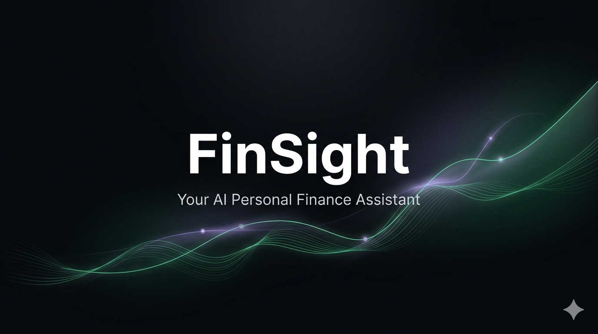
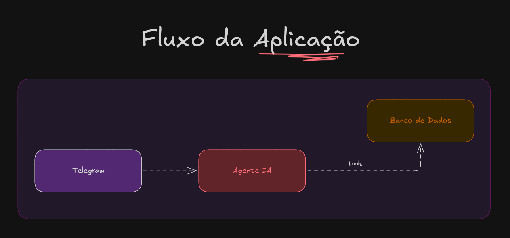

# FinSight
### 💵 Assistente Financeiro Pessoal e Inteligente

**Tagline:** Converse com suas finanças em linguagem natural.

O usuário registra suas transações pelo chatbot, a API faz a ponte dos dados, e um agente LangChain responde perguntas do tipo "quanto gastei com alimentação esse mês?" ou "qual foi o meu pior mês esse ano?".

#### Funcionalidades

**Telegram (app de mensagens)**
- Chat para inserir transações (valor, categoria, descrição, data).
- Campo de chat para conversar com o agente.

**Ferramentas do Agente de IA**
- Assistentes de Contas a pagar:
    - get_info_user Retorna nome, idade e cidade do usuário.
    - create_transaction_unique Cria uma conta a pagar única.
    - create_transaction_recurrence Cria contas a pagar recorrentes
    - get_due_bills Lista contas que vencem nos próximos X dias.
    - get_due_bills_today Lista contas que vencem hoje.
    - get_bills_today Lista com as contas pagas da data de hoje.
    - update_status_bills_by_today Marca todas as contas de hoje como pagas.
    - update_status_by_id Altera uma conta específica como Paga ou A pagar pelo ID.
    - update_description_by_id Atualiza a descrição de um registro pelo ID.
    - update_date_by_id Atualiza a data de um registro pelo ID.
    - update_recipient_by_id Atualiza o destinatário de um registro pelo ID.
    - update_value_by_id Atualiza o valor de um registro pelo ID.
    - update_category_by_id Atualiza a categoria de um registro pelo ID.
    - deletar_conta Remover ou excluir um lançamento.
    - value_total_by_category Total a pagar por categoria.
    - get_transactions_by_date Listar lançamentos por data

**Estrutura do Agente de IA**
- LLM como cérebro e inteligência.
- Tools para extender o braço de execução do agente.
- Memória de conversa por sessão individual do usuário (curto prazo).
- Respostas em linguagem natural, em português.

**Banco de dados (SQLite)**
- Tabela única para cada usuário criada a partir da primeira interação.
- Tabela transactions: id, amount, category, description, date, type (income/expense)
​
#### Fluxos

O diagrama abaixo representa o fluxo principal da aplicação com três componentes: o FrontEnd no telegram que encaminha mensagens de chat para o Agente IA, que também acessa o banco por meio de tools.

#### Ferramentas do Projeto

    - LangChain: framework que conecta o agente, as ferramentas e o LLM em um único fluxo
    - SQLite: banco de dados local e leve, sem servidor, que armazena todas as transações
    - Visual Studio Code: editor de código principal do projeto
    - Claude: assistente de IA utilizado como apoio durante o desenvolvimento
    - Google Gemini: modelo de linguagem que alimenta o agente, interpretando as mensagens e acionando as ferramentas certas
    - Excalidraw: ferramentas de diagramação usadas para planejar e documentar a arquitetura do projeto visualmente
​

